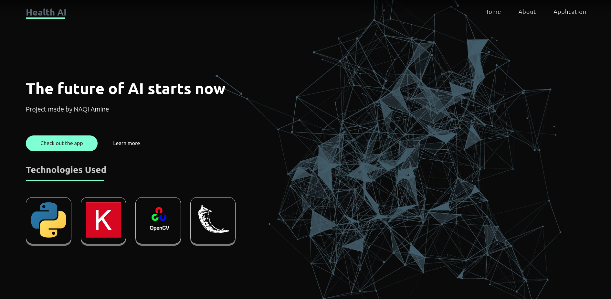

## This project's goal is to be able to distinguish between brain images that contains tumors, and others that do not !

To be able to run this project you should have multiple libraries installed using pip.

       pip3 install lib_name==version
 
For my setup i used :

       
Library         | Version
-------------   | -------------
Tensorflow      | 2.5.1
Tensorflow-gpu  | 2.5.1
scikit-image    | 0.18.3
scikit-learn    | 1.0
Pillow          | 7.0.0
Flask           | 2.0.1
h5py            | 3.1.0
numpy           | 1.19.2
opencv          | 4.5.1
opencv-contrib-python  | 4.5.1
matplotlib      | 3.4.3
       

You also need CUDA, and CUDNN on your computer to be able to run the program. My version is 11.2 for cuda and 8.0.4 for cudnn.
 
 Feel free to test the project by typing :
 
      cd /path_to_ai_flask_folder/python3 web.py
